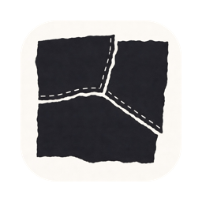
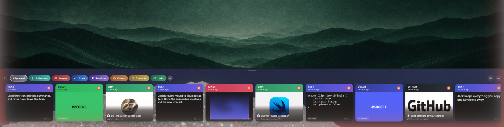
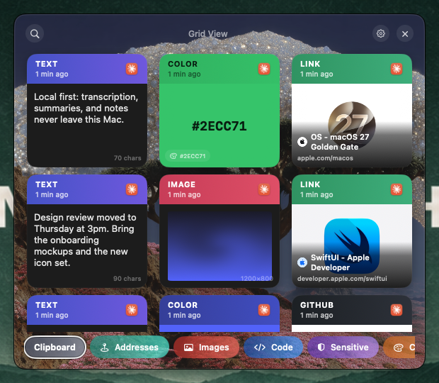
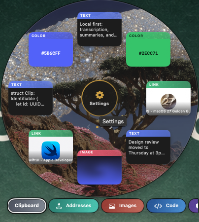
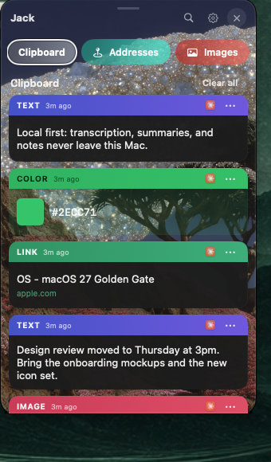
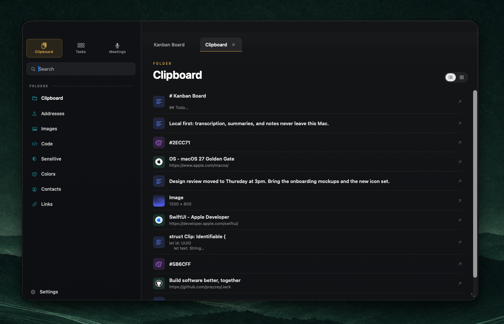
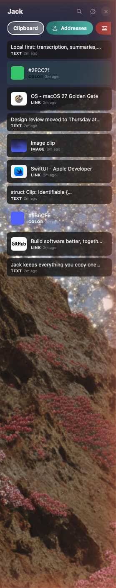
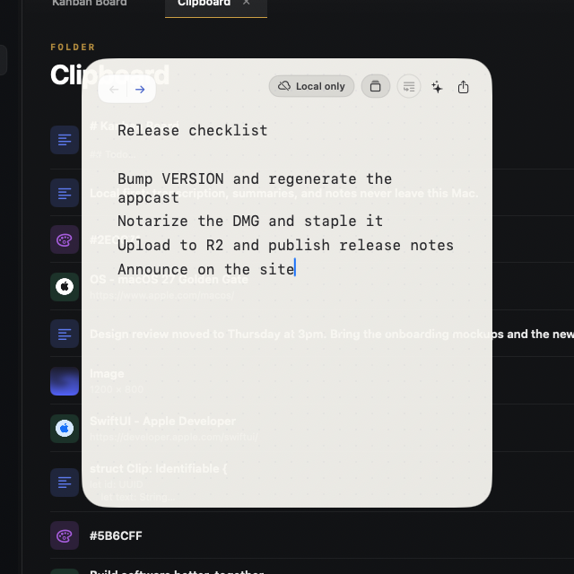

<p align="center">
  
</p>

<h1 align="center">Jack</h1>

Jack is a local-first macOS app that keeps your clipboard history, dictation, meeting notes, quick notes, and a kanban board in one native bottom-of-screen tray. The code is open source under the MIT License. The finished app is sold, signed, and notarized at [gilt.novor.dev](https://gilt.novor.dev).

<p align="center">
  
</p>


## What it does

- Clipboard history with folders, search, and smart categories for links, code, colors, contacts, addresses, and sensitive content, with quick paste from a global hotkey
- Tray, drawer, grid, and radial view modes, plus a full workspace window
- Dictation that runs on your Mac, with streaming transcription and context-aware cleanup
- Meeting notes transcribed and summarized locally
- Quick notes with Markdown, image attachments, and Obsidian vault sync
- Kanban board with text assist, reminders mirrored into Apple Reminders, and a command palette
- Automatic updates through Sparkle

Everything runs on your machine. Speech and language models download from Hugging Face on first use and are cached locally.

## Screenshots

Every view shows the same history. Pick the one that fits how you work.

<table>
  <tr>
    <td align="center"><br><sub>Grid</sub></td>
    <td align="center"><br><sub>Radial</sub></td>
    <td align="center"><br><sub>Panel</sub></td>
  </tr>
</table>

<p align="center">
  
</p>

<table>
  <tr>
    <td align="center"><br><sub>Drawer</sub></td>
    <td align="center"><br><sub>Quick Note</sub></td>
  </tr>
</table>

## Download

Get the current release from [gilt.novor.dev](https://gilt.novor.dev) or grab the DMG directly at https://downloads.gilt.novor.dev/Gilt.dmg. Jack needs macOS 14 Sonoma or later.

## Open source and paid

The source is MIT licensed, so you can build, modify, and redistribute it. The official download is a paid app: a 24-hour trial, then a one-time license that activates up to three Macs. Buying a license pays for Developer ID signing, notarization, update hosting, and continued development.

If you build from source, the license gate in `Sources/Gilt/Services/ClipboardStore+Licensing.swift` still runs. You are welcome to remove it for your own builds. Please do not sell rebuilt copies under the Jack name.

## Build from source

Requirements: macOS 14 or later, and Xcode 26 with the Swift 6.2 toolchain or newer.

```bash
git clone https://github.com/prayzey/Jack.git
cd Jack
swift build
```

To run Jack the way users will, build the `.app` bundle instead of using `swift run`. Pasting into other apps only works from a proper bundle.

```bash
./scripts/install-jack-cli.sh   # one time: puts `jack` on your PATH
jack start                      # builds Jack.app and launches it
```

`./run` does the same without the PATH setup. After the first launch, grant Accessibility access in System Settings > Privacy & Security > Accessibility.

The bundle script signs with a Developer ID certificate by default. If you do not have one, sign ad hoc instead:

```bash
SIGN_IDENTITY=- ./scripts/build-app.sh
```

Streaming dictation uses a small native helper built from transcribe.cpp. It is optional and needs CMake:

```bash
./scripts/build-transcribe-helper.sh
```

## Tests

```bash
swift test
```

The tests in `LivePolishIntegrationManualTests` need local models and are meant to be run by hand.

## Project layout

- `Sources/Gilt/` holds the app: `App`, `Models`, `Services`, `Views`, `Localization`, and `Resources`
- `Tests/JackTests/` holds the unit tests
- `scripts/` builds, signs, notarizes, and publishes releases
- `Vendor/` holds the source for the streaming transcription helper

The app was renamed from Gilt to Jack. The SwiftPM target, the bundle ID `com.praisedev.gilt`, and the on-disk store keep the old name so existing installs upgrade cleanly. `CLAUDE.md` documents the full naming policy and the architecture rules that keep the tray window working.

## Releases

Release builds are signed, notarized, and published with the scripts in `scripts/`. Signing keys, the notarization profile, the Sparkle private key, and upload credentials live in Keychain and local CLI profiles, never in this repository. The release flow is written up in `CLAUDE.md`.

## Privacy and telemetry

Clips, notes, transcripts, and models stay on your Mac. There is no account and no server-side copy of your data. Official builds send anonymous usage events to TelemetryDeck and crash reports to Sentry so problems can be found and fixed. The identifiers are in `Sources/Gilt/Services/AnalyticsService.swift` and `Sources/Gilt/Jack.swift`. Remove them if you do not want your own build to report.

## Contributing

See `CONTRIBUTING.md`. Licenses for bundled and downloaded third-party work are listed in `THIRD_PARTY_NOTICES.md`.

## License

MIT. See `LICENSE`.
